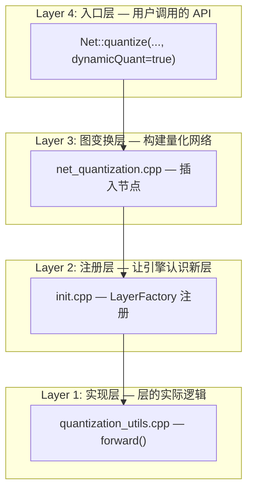
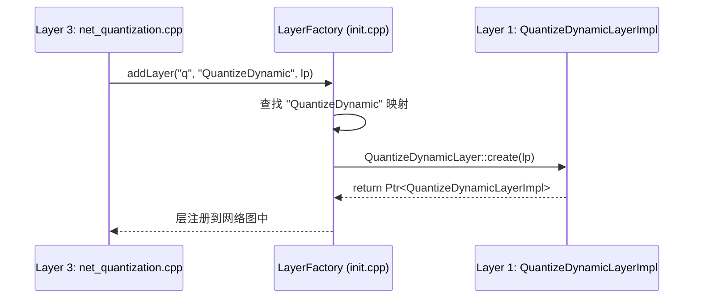
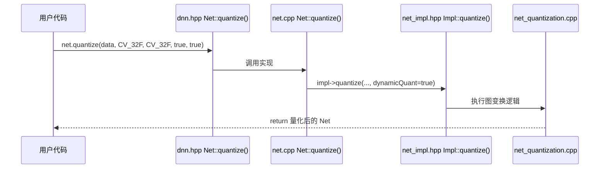
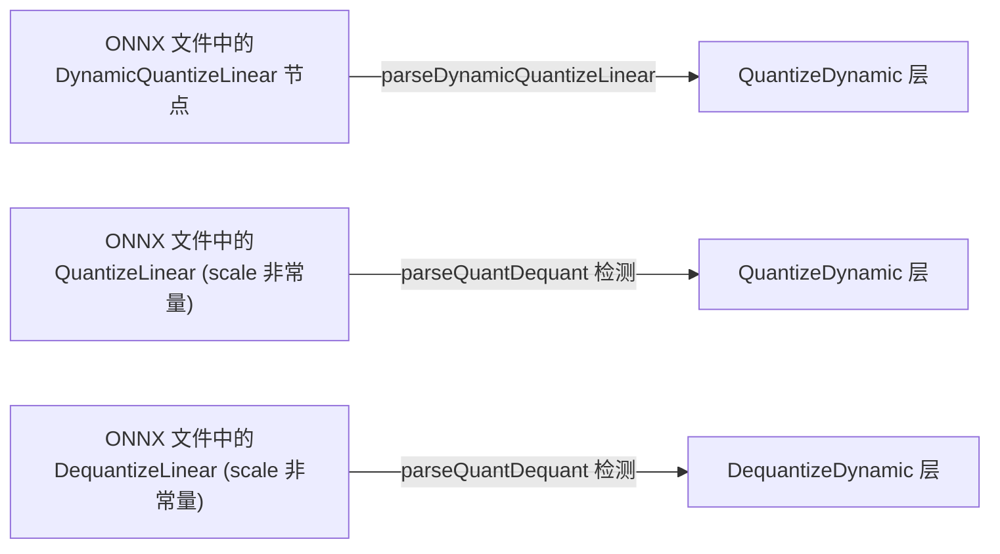

# 动态量化改动架构全解

## 四个逻辑层

我们的改动涉及 OpenCV DNN 的 **四个逻辑层**，它们在代码中是自底向上依赖的关系：



---

## Layer 1: 实现层 — 层的实际计算逻辑

**文件**: [quantization_utils.cpp](file:///Users/mac/Documents/GitHub/opencv/modules/dnn/src/int8layers/quantization_utils.cpp#L595-L729)

**角色**: 定义 `QuantizeDynamicLayerImpl` 和 `DequantizeDynamicLayerImpl` 的 `forward()` 逻辑 — 推理时每一帧数据经过这些层时，实际执行什么计算。

### QuantizeDynamicLayerImpl::forward()

```
输入: FP32 激活值 tensor (比如 [1, 64, 56, 56])
                    │
                    ▼
        ┌─── minMaxIdx(input) ───┐
        │  rmin = -2.3           │   ← 动态统计：每次 forward 都重新算
        │  rmax = 5.1            │
        └────────────────────────┘
                    │
                    ▼
        scale = (5.1 - (-2.3)) / 255 = 0.029
        zp = round(-128 - (-2.3) / 0.029) = -49
                    │
                    ▼
        ┌───────────┼───────────┐
        │           │           │
   output[0]   output[1]   output[2]
   INT8 数据    scale=0.029  zp=-49
   (同shape)   (1×1 Mat)   (1×1 Mat)
```

> [!IMPORTANT]
> 与静态 `QuantizeLayerImpl` 的关键区别：静态层在 `finalize()` 时 scale/zp 已经固定了（从 LayerParams 读取），不会再变。动态层每次 `forward()` 都重新算。

### DequantizeDynamicLayerImpl::forward()

```
input[0]: INT8 数据        ──┐
input[1]: scale (来自图连线)  ├──→  output = scale * (int8_data - zp)  ──→  FP32
input[2]: zp (来自图连线)    ──┘
```

核心就一行：`inputs[0].convertTo(outputs[0], CV_32F, sc, -(sc * zp))`

---

## Layer 2: 注册层 — 让引擎找到新层

**文件**: [init.cpp](file:///Users/mac/Documents/GitHub/opencv/modules/dnn/src/init.cpp#L206-L207)

**角色**: 在 `initializeLayerFactory()` 中注册 type string → class 的映射。

```cpp
CV_DNN_REGISTER_LAYER_CLASS(QuantizeDynamic,  QuantizeDynamicLayer);
CV_DNN_REGISTER_LAYER_CLASS(DequantizeDynamic, DequantizeDynamicLayer);
```

**联动方式**: 当 Layer 3（图变换层）调用 `dstNet.addLayer("xxx", "QuantizeDynamic", ...)` 时，DNN 引擎通过 `LayerFactory` 查找 `"QuantizeDynamic"` 字符串，找到这里注册的 `QuantizeDynamicLayer::create()`，然后实例化 Layer 1 中的 `QuantizeDynamicLayerImpl`。



---

## Layer 3: 图变换层 — 构建量化网络图

**文件**: [net_quantization.cpp](file:///Users/mac/Documents/GitHub/opencv/modules/dnn/src/net_quantization.cpp#L36)

**角色**: 这是最复杂的一层。它把一个 FP32 网络 **变换** 成一个量化网络 — 在需要的地方插入 Quantize/Dequantize 节点。

### 静态 vs 动态：做了什么不同的事

#### 阶段 1: 校准（L77-L135）

```
静态模式:
  对每个层 → 用 calibData 跑一次 forward
  → 统计每层输出的 min/max → 算出固定的 scale/zp
  → 存入 scales[], zeropoints[]

动态模式:
  对每个层 → 权重照常算 scale/zp (权重是固定的，可以静态量化)
  → 激活值的 scale/zp 用占位值 (1.0, 0)   ← 这里不同！
  → 因为运行时才算，这里只是占位
```

#### 阶段 2: 插入量化节点（L196-L270）

这里遍历每一条 "层与层之间" 的连接线，当发现 dtype 不匹配时（比如 FP32→INT8），就插入一个 Quantize/Dequantize 节点。

```
静态模式:
  LayerParams lp;
  lp.set("scales", 预先算好的值);      ← 把固定值写死到层参数里
  lp.set("zeropoints", 预先算好的值);
  lp.type = "Quantize";                 ← 用静态层

动态模式:
  LayerParams lp;
  // 不设 scales/zeropoints！         ← 参数为空
  lp.type = "QuantizeDynamic";          ← 用动态层，forward 时自己算
```

### 图变换的具体例子

假设原始 FP32 网络是：
```
Input(FP32) → Conv(FP32) → ReLU(FP32) → Output(FP32)
```

经过 `quantize(..., dynamicQuant=true)` 后变成：

```
Input(FP32)
    │
    ▼
[QuantizeDynamic]  ← 新插入，3个输出
    ├── output[0]: INT8 数据 ──→ [ConvInt8] ──→ [ReLUInt8] ──→ INT8 结果
    ├── output[1]: scale ─────────────────────────────────────┐
    └── output[2]: zp ───────────────────────────────────────┐│
                                                              ││
                                                              ▼▼
                                                    [DequantizeDynamic]
                                                              │
                                                              ▼
                                                        Output(FP32)
```

对应的代码调用序列：
```cpp
// net_quantization.cpp 中的逻辑 (伪代码):

// 1. 发现 Input(FP32) → Conv(INT8) 需要转换
lp.type = "QuantizeDynamic";
int qLid = dstNet.addLayer("quantize/input", "QuantizeDynamic", CV_8S, lp);
dstNet.connect(inputLid, 0, qLid, 0);   // Input → QuantizeDynamic

// 2. QuantizeDynamic.output[0] → Conv
dstNet.connect(qLid, 0, convLid, 0);

// 3. 发现 ReLU(INT8) → Output(FP32) 需要转换
lp.type = "DequantizeDynamic";
int dqLid = dstNet.addLayer("dequantize/relu", "DequantizeDynamic", CV_32F, lp);
dstNet.connect(reluLid, 0, dqLid, 0);   // ReLU.output → DequantizeDynamic.input[0]
```

---

## Layer 4: 入口层 — 用户 API

**文件**: [dnn.hpp](file:///Users/mac/Documents/GitHub/opencv/modules/dnn/include/opencv2/dnn/dnn.hpp#L668) → [net.cpp](file:///Users/mac/Documents/GitHub/opencv/modules/dnn/src/net.cpp#L119) → [net_impl.hpp](file:///Users/mac/Documents/GitHub/opencv/modules/dnn/src/net_impl.hpp#L286)

**角色**: 提供用户接口，把 `dynamicQuant` 参数一路传到 Layer 3。



三个文件只是做参数传递：
- `dnn.hpp`: 声明 — 用户可见的接口定义
- `net.cpp`: wrapper — 转发到 `impl`
- `net_impl.hpp`: 声明 `Impl::quantize()` — 真正实现在 `net_quantization.cpp`

---

## 额外路径: ONNX 导入

**文件**: [onnx_importer.cpp](file:///Users/mac/Documents/GitHub/opencv/modules/dnn/src/onnx/onnx_importer.cpp)

**角色**: 当用户 `readNetFromONNX("model.onnx")` 加载一个**已经被动态量化的模型**时，ONNX importer 需要识别相应的算子并映射到我们的层。



这条路径**不经过 Layer 3** — 因为 ONNX 模型本身已经告诉了图的结构，importer 直接建图，不需要 `quantize()` 变换。

---

## 全局联动总览

```
┌─────────────────────────────────────────────────────────────────────┐
│                        两条入口路径                                   │
│                                                                     │
│  路径 A: API 调用                    路径 B: ONNX 加载               │
│  net.quantize(..., dynamic=true)    readNetFromONNX("dyn_quant.onnx")│
│         │                                    │                       │
│         ▼                                    ▼                       │
│  Layer 4: dnn.hpp/net.cpp            onnx_importer.cpp               │
│         │                            parseDynamicQuantizeLinear()     │
│         ▼                                    │                       │
│  Layer 3: net_quantization.cpp               │                       │
│  (图变换: 插入动态层节点)                      │                       │
│         │                                    │                       │
│         └──────────┬─────────────────────────┘                       │
│                    ▼                                                 │
│  Layer 2: init.cpp — LayerFactory 查找 "QuantizeDynamic"             │
│                    │                                                 │
│                    ▼                                                 │
│  Layer 1: quantization_utils.cpp — forward() 执行                    │
│           minMaxIdx → scale/zp → convertTo(CV_8S)                    │
│                                                                     │
│  ═══════════════════════════════════════════                         │
│  推理循环: net.forward() 每次调用时，                                  │
│  Layer 1 的 forward() 重新计算 scale/zp → 动态适应输入                 │
└─────────────────────────────────────────────────────────────────────┘
```
