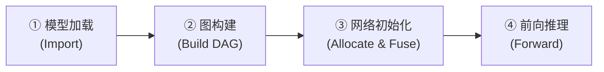
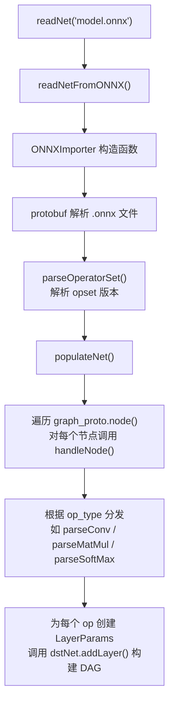
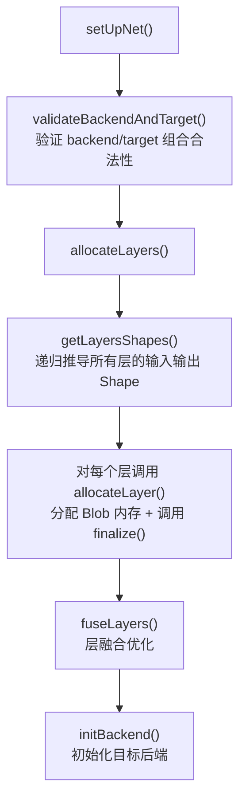
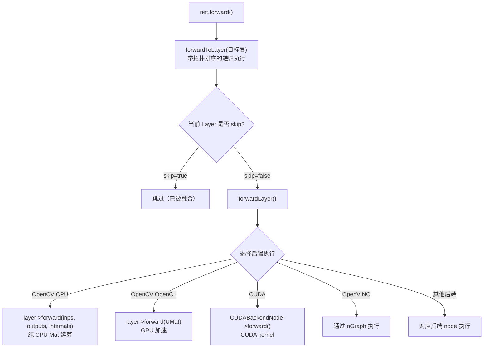
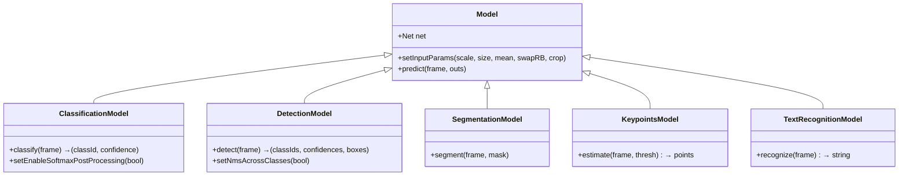

# OpenCV DNN 模块架构分析

## 1. 设计定位

> [!IMPORTANT]
> DNN 模块**只支持前向推理（inference）**，不支持训练（training）。它的核心价值是：从各种深度学习框架（PyTorch/ONNX、TensorFlow、Caffe、Darknet 等）加载预训练模型，然后在 OpenCV 内部高效地执行推理。

---

## 2. 完整目录结构

### 2.1 公开头文件 (`include/opencv2/`)

```
include/opencv2/
├── dnn.hpp                        # 伞头文件（umbrella header）
│                                  # 只有一行有效代码: #include <opencv2/dnn/dnn.hpp>
│                                  # 用户只需 #include <opencv2/dnn.hpp> 即可使用全部公开 API
│
└── dnn/                           # 公开 API 按职责拆分的头文件
    ├── dnn.hpp           (97KB)   # ★ 核心 API：Net, Layer 基类, LayerParams, Backend/Target 枚举,
    │                              #   readNetFrom*(), blobFromImage(), Model/DetectionModel/... 全在这里
    │                              #   末尾 #include 了 layer.hpp 和 dnn.inl.hpp
    │
    ├── dict.hpp          (6KB)    # DictValue 和 Dict 类声明（参数字典，LayerParams 继承自 Dict）
    ├── dnn.inl.hpp       (10KB)   # Dict/DictValue 的模板和 inline 函数实现
    │                              #   (.inl = inline implementation，C++ 惯例，把模板实现从声明中分离)
    ├── version.hpp       (0.8KB)  # OPENCV_DNN_API_VERSION 宏 + inline namespace 版本控制
    ├── layer.hpp         (3KB)    # LayerFactory 工厂类（registerLayer, createLayerInstance）
    ├── layer.details.hpp (3KB)    # CV_DNN_REGISTER_LAYER_CLASS 等注册宏 + 辅助模板
    │                              #   ⚠️ 不被 dnn.hpp 自动包含，需显式 #include（仅内部 init.cpp 和测试使用）
    ├── layer_reg.private.hpp      # 内部层注册私有接口
    │
    ├── all_layers.hpp    (40KB)   # 所有 60+ 种具体 Layer 子类的声明（ConvolutionLayer, ReLULayer, LSTMLayer...）
    │                              #   ⚠️ 不被 dnn.hpp 自动包含（通过内部 precomp.hpp 引入）
    ├── shape_utils.hpp   (8KB)    # shape(), total(), normalize_axis() 等张量形状工具函数
    │                              #   ⚠️ 不被 dnn.hpp 自动包含（各层实现按需 #include）
    │
    └── utils/
        ├── inference_engine.hpp   # OpenVINO Inference Engine 兼容接口
        └── debug_utils.hpp        # 调试工具
```

> [!NOTE]
> 标 ⚠️ 的文件不会通过 `#include <opencv2/dnn.hpp>` 自动引入。它们是给 DNN 模块内部开发者用的，外部用户做推理不需要。内部通过 [precomp.hpp](file:///Users/mac/Documents/GitHub/opencv/modules/dnn/src/precomp.hpp) 统一包含。

---

### 2.2 源码实现 (`src/`)

#### 核心引擎

```
src/
├── precomp.hpp              # 预编译头，所有内部 .cpp 都 include 它
│                            #   包含 dnn.hpp + all_layers.hpp + shape_utils.hpp
│
├── net.cpp          (11KB)  # Net 公开 API 的转发实现（转调 Net::Impl）
├── net_impl.hpp     (9KB)   # ★ Net::Impl 内部结构声明（DAG 容器、BlobManager、backend 字段）
├── net_impl.cpp     (84KB)  # ★ Net::Impl 核心实现：setUpNet(), allocateLayers(), forwardLayer()
├── net_impl_fuse.cpp(45KB)  # ★ 层融合优化逻辑：Conv+BN, Conv+Activation, Concat 消除 等
├── net_impl_backend.cpp(9KB)# 后端初始化/切换逻辑
├── net_openvino.cpp (33KB)  # OpenVINO 专用后端整合
├── net_cann.cpp     (14KB)  # 华为昇腾 CANN 后端整合
├── net_quantization.cpp(12KB)# INT8 量化流程
│
├── layer_internals.hpp(10KB)# ★ LayerPin, LayerData, DataLayer 核心数据结构定义
├── layer.cpp        (8KB)   # Layer 基类虚函数默认实现
├── layer_factory.cpp(3KB)   # LayerFactory 内部实现（维护 string→constructor 的 map）
├── init.cpp         (13KB)  # ★ 所有 120+ 种内置 Layer 的工厂注册
│
├── dnn.cpp          (0.5KB) # 模块入口（触发 init）
├── dnn_common.hpp   (5KB)   # 内部共用宏和工具
├── dnn_params.cpp   (2KB)   # DNN 环境参数配置
├── dnn_read.cpp     (4KB)   # readNet() 统一入口，按文件扩展名分发到各 importer
├── dnn_utils.cpp    (21KB)  # blobFromImage(), blobFromImages() 等预处理工具实现
├── model.cpp        (51KB)  # 高层 Model API（ClassificationModel, DetectionModel, SegmentationModel...）
├── nms.cpp          (7KB)   # 非极大值抑制（NMS）实现
├── nms.inl.hpp      (4KB)   # NMS 内联实现
│
├── math_utils.hpp   (2KB)   # 数学工具（fastPow 等）
├── factory.hpp      (0.9KB) # 内部工厂辅助
├── registry.cpp     (6KB)   # 后端注册表
├── debug_utils.cpp  (2KB)   # 调试输出
│
├── backend.hpp/cpp          # 后端抽象基类
├── legacy_backend.hpp/cpp   # 旧版后端兼容层
├── graph_simplifier.hpp/cpp # 通用图简化器（模式匹配替换）
├── halide_scheduler.hpp/cpp # Halide JIT 调度策略
├── ie_ngraph.hpp/cpp        # OpenVINO nGraph 接口封装
├── plugin_api.hpp           # 插件 API
└── plugin_wrapper.impl.hpp  # 插件包装器实现
```

---

#### 后端适配层 (`op_*.hpp/cpp`)

```
src/
├── op_cuda.hpp      (23KB)  # CUDA 后端的 BackendNode/BackendWrapper 定义
├── op_cuda.cpp      (4KB)   # CUDA 后端初始化
├── op_halide.hpp/cpp        # Halide 后端适配
├── op_inf_engine.hpp/cpp    # OpenVINO Inference Engine 适配
├── op_vkcom.hpp/cpp         # Vulkan Compute 后端适配
├── op_timvx.hpp/cpp         # VeriSilicon TimVX NPU 后端适配
├── op_cann.hpp/cpp          # 华为昇腾 CANN 后端适配
└── op_webnn.hpp/cpp         # Web Neural Network API 后端适配
```

---

#### 算子实现 (`layers/`)

```
src/layers/                        # 57 个 Layer 算子实现 + 1 个子目录
│
│  ── 卷积与线性 ──
├── convolution_layer.cpp  (94KB)  # ★ 卷积层（最大最复杂的单文件）
├── fully_connected_layer.cpp(37KB)# 全连接层（InnerProduct / MatMul / Gemm）
├── gemm_layer.cpp         (16KB)  # 通用矩阵乘法
├── matmul_layer.cpp       (20KB)  # MatMul 算子
│
│  ── 池化与规约 ──
├── pooling_layer.cpp      (63KB)  # 池化层（Max/Average/ROI/PSROIPooling）
├── max_unpooling_layer.cpp(9KB)   # 反池化
├── reduce_layer.cpp       (22KB)  # Reduce 算子（Sum/Mean/Max/Min/L1/L2/Prod）
│
│  ── 激活函数 ──
├── elementwise_layers.cpp (106KB) # ★ 所有逐元素激活函数的大合集
│                                  #   ReLU, Sigmoid, Tanh, Swish, Mish, GELU, HardSwish,
│                                  #   ELU, Abs, Log, Exp, Ceil, Floor, Sqrt, Erf, Sin, Cos...
├── eltwise_layer.cpp      (40KB)  # 多输入逐元素运算（Add/Multiply/Max/Sub/Div）
├── nary_eltwise_layers.cpp(46KB)  # N元逐元素运算
│
│  ── 归一化 ──
├── batch_norm_layer.cpp   (20KB)  # BatchNorm
├── layer_norm.cpp         (16KB)  # LayerNorm
├── group_norm_layer.cpp   (8KB)   # GroupNorm
├── instance_norm_layer.cpp(12KB)  # InstanceNorm
├── lrn_layer.cpp          (19KB)  # 局部响应归一化 (LRN)
├── mvn_layer.cpp          (15KB)  # 均值方差归一化 (MVN)
├── normalize_bbox_layer.cpp(13KB) # L2Normalize
│
│  ── 形状变换 ──
├── reshape_layer.cpp      (21KB)  # Reshape
├── flatten_layer.cpp      (10KB)  # Flatten
├── permute_layer.cpp      (22KB)  # Transpose/Permute
├── concat_layer.cpp       (21KB)  # Concat 拼接
├── slice_layer.cpp        (40KB)  # Slice/Crop/StridedSlice
├── split_layer.cpp        (5KB)   # Split 拆分
├── padding_layer.cpp      (12KB)  # Pad 填充
├── tile_layer.cpp         (4KB)   # Tile 重复
├── expand_layer.cpp       (7KB)   # Expand 广播
├── depth_space_ops_layer.cpp(23KB)# DepthToSpace / SpaceToDepth
├── shuffle_channel_layer.cpp(6KB) # ShuffleChannel（ShuffleNet）
├── resize_layer.cpp       (22KB)  # Resize/Upsample 上下采样
│
│  ── Softmax ──
├── softmax_layer.cpp      (14KB)  # Softmax / LogSoftmax
│
│  ── Scale/Shift ──
├── scale_layer.cpp        (21KB)  # Scale + Shift
│
│  ── 序列/注意力 ──
├── recurrent_layers.cpp   (46KB)  # LSTM 和 GRU 循环层
├── attention_layer.cpp    (14KB)  # Transformer Multi-Head Attention
├── einsum_layer.cpp       (57KB)  # Einstein Summation
│
│  ── 索引/聚合 ──
├── gather_layer.cpp       (5KB)   # Gather
├── gather_elements_layer.cpp(7KB) # GatherElements
├── scatter_layer.cpp      (9KB)   # Scatter
├── scatterND_layer.cpp    (9KB)   # ScatterND
├── arg_layer.cpp          (3KB)   # ArgMax / ArgMin
├── topk_layer.cpp         (8KB)   # TopK
├── cumsum_layer.cpp       (6KB)   # CumSum 累加
│
│  ── 目标检测专用 ──
├── detection_output_layer.cpp(43KB)# SSD DetectionOutput（含 NMS）
├── prior_box_layer.cpp    (25KB)  # SSD PriorBox 先验框生成
├── proposal_layer.cpp     (16KB)  # Faster R-CNN Proposal 层
├── region_layer.cpp       (30KB)  # YOLO Region 层
├── reorg_layer.cpp        (9KB)   # YOLO Reorg 重组层
├── crop_and_resize_layer.cpp(8KB) # CropAndResize
│
│  ── 杂项 ──
├── const_layer.cpp        (7KB)   # 常量层（输出固定 Blob）
├── blank_layer.cpp        (7KB)   # 空白层（Identity / Dropout / Silence）
├── flow_warp_layer.cpp    (4KB)   # 光流 Warp
├── correlation_layer.cpp  (8KB)   # 相关性计算
├── accum_layer.cpp        (5KB)   # 累加
├── randomnormallike_layer.cpp(4KB)# 随机正态分布
├── not_implemented_layer.cpp(6KB) # 未实现层占位符（诊断用）
│
│  ── 共用代码 ──
├── layers_common.hpp      (5KB)   # 层实现的公共头文件
├── layers_common.cpp      (11KB)  # 公共工具函数
├── layers_common.simd.hpp (42KB)  # SIMD 加速的公共内核
│
└── cpu_kernels/                   # CPU 高性能计算内核
    ├── convolution.hpp/cpp (93KB) # 卷积 CPU 实现（im2col + GEMM）
    ├── conv_block.simd.hpp (27KB) # 卷积分块 SIMD 内核
    ├── conv_depthwise.cpp  (19KB) # 深度可分离卷积
    ├── conv_depthwise.simd.hpp    # 深度卷积 SIMD 内核
    ├── conv_winograd_f63.cpp(12KB)# Winograd F(6,3) 快速卷积
    ├── conv_winograd_f63.simd.hpp(81KB)  # Winograd SIMD 内核（最大文件）
    ├── fast_gemm.hpp/cpp   (21KB) # 快速矩阵乘法
    ├── fast_gemm_kernels.simd.hpp(38KB)  # GEMM SIMD 内核
    ├── fast_gemm_kernels.default.hpp     # GEMM 默认实现
    ├── fast_norm.hpp/cpp   (10KB) # 快速归一化内核
    └── softmax.hpp/cpp     (6KB)  # Softmax CPU 内核
```

---

#### INT8 量化层 (`int8layers/`)

```
src/int8layers/                    # INT8 量化版本的层实现（13 个文件）
├── layers_common.hpp              # INT8 层公共头
├── layers_common.simd.hpp (85KB)  # INT8 SIMD 加速内核
├── convolution_layer.cpp  (77KB)  # INT8 卷积
├── fully_connected_layer.cpp(20KB)# INT8 全连接
├── pooling_layer.cpp      (34KB)  # INT8 池化
├── batch_norm_layer.cpp   (12KB)  # INT8 BatchNorm
├── elementwise_layers.cpp (13KB)  # INT8 激活函数
├── eltwise_layer.cpp      (29KB)  # INT8 逐元素运算
├── scale_layer.cpp        (9KB)   # INT8 Scale
├── softmax_layer.cpp      (15KB)  # INT8 Softmax
├── quantization_utils.cpp (21KB)  # 量化/反量化工具
└── layers_rvp052.hpp/cpp          # RVP052 量化辅助
```

---

#### 模型导入器

```
src/onnx/                          # ONNX 导入器（4 个文件）
├── onnx_importer.cpp     (163KB)  # ★ ONNX 算子 → OpenCV Layer 的映射（最大源文件）
├── onnx_graph_simplifier.cpp(72KB)# ONNX 图简化（模式匹配合并节点）
├── onnx_graph_simplifier.hpp
└── opencv-onnx.proto     (17KB)   # ONNX protobuf 定义

src/caffe/                         # Caffe 导入器（6 个文件）
├── caffe_importer.cpp    (24KB)   # .prototxt + .caffemodel 解析
├── caffe_io.hpp/cpp      (54KB)   # Caffe Blob I/O
├── caffe_shrinker.cpp    (2KB)    # 模型压缩
├── glog_emulator.hpp              # Caffe glog 兼容
└── opencv-caffe.proto    (68KB)   # Caffe protobuf 定义

src/tensorflow/                    # TensorFlow 导入器（13 个文件）
├── tf_importer.cpp       (127KB)  # .pb 图解析（第二大源文件）
├── tf_graph_simplifier.hpp/cpp    # TF 图简化
├── tf_io.hpp/cpp                  # TF protobuf I/O
└── *.proto (7 个)                 # TF protobuf 定义（attr_value, graph, tensor...）

src/tflite/                        # TFLite 导入器（3 个文件）
├── tflite_importer.cpp   (55KB)   # FlatBuffers 解析
├── schema.fbs            (33KB)   # TFLite FlatBuffers schema
└── builtin_op_data.h              # TFLite 算子定义

src/darknet/                       # Darknet 导入器（3 个文件）
├── darknet_importer.cpp  (8KB)    # .cfg 解析入口
├── darknet_io.hpp/cpp    (57KB)   # .cfg + .weights 二进制读取
 
src/torch/                         # Torch7 导入器（9 个文件）
├── torch_importer.cpp    (49KB)   # Torch7 序列化格式解析
├── THDiskFile.h/cpp               # Torch 文件 I/O 移植
├── THFile.h/cpp                   # Torch 文件抽象
├── THFilePrivate.h
├── THGeneral.h/cpp                # Torch 基础工具
└── COPYRIGHT.txt                  # Torch 版权声明
```

---

#### 硬件后端实现

```
src/cuda4dnn/              # NVIDIA CUDA 后端（独立子目录树，大量 .hpp 内核）
src/cuda/                  # CUDA 辅助代码
src/ocl4dnn/               # OpenCL 后端实现
src/opencl/                # OpenCL kernel 文件
src/vkcom/                 # Vulkan Compute 后端
src/webnn/                 # WebNN 后端
```

---

## 3. 核心数据结构

DNN 模块将神经网络表示为 **有向无环图 (DAG)**，节点是 Layer，边是 Blob（`cv::Mat`）的数据流。

### 3.1 `LayerPin` — 图中的"插脚"

```cpp
struct LayerPin {
    int lid;  // Layer ID
    int oid;  // Output ID (一个 Layer 可有多个输出)
};
```

用于标识 DAG 中的一个具体输出位置，例如 `LayerPin(3, 0)` 表示 Layer #3 的第 0 个输出。

### 3.2 `LayerData` — 节点元数据

```cpp
struct LayerData {
    int id;
    String name, type;
    int dtype;               // 输出数据类型 (CV_32F, CV_16F, CV_8S)
    LayerParams params;      // 参数字典 + 权重 blobs
    
    // DAG 拓扑信息
    std::vector<LayerPin> inputBlobsId;   // 输入来源
    std::set<int> inputLayersId;          // 输入 Layer IDs
    std::vector<LayerPin> consumers;      // 下游消费者
    
    // 运行时数据
    Ptr<Layer> layerInstance;              // 实际 Layer 实例
    std::vector<Mat> outputBlobs;         // 输出数据
    std::vector<Mat*> inputBlobs;         // 输入数据指针
    std::map<int, Ptr<BackendNode>> backendNodes;  // 后端节点
    bool skip;                            // 融合后跳过标记
};
```

### 3.3 `Net::Impl` — 网络引擎核心

```cpp
struct Net::Impl {
    MapIdToLayerData layers;          // ID → LayerData 映射（DAG 节点集合）
    std::map<String, int> layerNameToId;  // 名称 → ID 映射
    Ptr<DataLayer> netInputLayer;     // 特殊的输入伪层 (id=0)
    BlobManager blobManager;          // 内存复用管理器
    int preferableBackend;            // 计算后端
    int preferableTarget;             // 目标设备
    bool fusion;                      // 是否启用层融合
};
```

### 3.4 `Layer` — 算子基类

```cpp
class Layer : public Algorithm {
    std::vector<Mat> blobs;           // 可学习参数（权重、偏置）
    
    virtual void forward(InputArrayOfArrays inputs,
                         OutputArrayOfArrays outputs,
                         OutputArrayOfArrays internals);
    virtual void finalize(...);
    virtual bool getMemoryShapes(...) const;
    virtual bool supportBackend(int backendId);
    virtual Ptr<BackendNode> initCUDA(...);
    virtual bool setActivation(const Ptr<ActivationLayer>& layer); // 融合支持
    virtual bool tryFuse(Ptr<Layer>& top);                         // 融合支持
};
```

---

## 4. 运作流水线

DNN 模块的完整工作流程分为 **4 个阶段**：



### 阶段 ① 模型加载 (Import)

入口函数 `readNet()` 根据文件扩展名自动选择解析器：

| 扩展名 | 解析器 | 源码位置 |
|--------|--------|----------|
| `.onnx` | `ONNXImporter` | [onnx_importer.cpp](file:///Users/mac/Documents/GitHub/opencv/modules/dnn/src/onnx/onnx_importer.cpp) |
| `.caffemodel` / `.prototxt` | `CaffeImporter` | `src/caffe/` |
| `.pb` / `.pbtxt` | `TFImporter` | `src/tensorflow/` |
| `.tflite` | `TFLiteImporter` | `src/tflite/` |
| `.cfg` / `.weights` | `DarknetImporter` | `src/darknet/` |
| `.t7` / `.net` | `TorchImporter` | `src/torch/` |
| `.xml` / `.bin` | OpenVINO IR | 直接走 `readFromModelOptimizer` |

以 ONNX 为例的加载流程：



**关键函数**：[ONNXImporter::populateNet()](file:///Users/mac/Documents/GitHub/opencv/modules/dnn/src/onnx/onnx_importer.cpp#L792) 和 [handleNode()](file:///Users/mac/Documents/GitHub/opencv/modules/dnn/src/onnx/onnx_importer.cpp#L130)

### 阶段 ② 图构建 (Build DAG)

每次 Importer 调用 `dstNet.addLayer()` 和 `dstNet.connect()`，Net::Impl 内部就构建起 DAG：

```cpp
// addLayer: 注册节点
int id = ++lastLayerId;
layers.insert({id, LayerData(id, name, type, dtype, params)});

// connect: 建立边
void connect(int outLayerId, int outNum, int inLayerId, int inNum) {
    addLayerInput(ldInp, inNum, LayerPin(outLayerId, outNum));  // 输入绑定
    ldOut.consumers.push_back(LayerPin(inLayerId, outNum));     // 消费者注册
}
```

### 阶段 ③ 网络初始化 (setUpNet)

当第一次调用 `forward()` 时，[setUpNet()](file:///Users/mac/Documents/GitHub/opencv/modules/dnn/src/net_impl.cpp#L127) 被触发，完成以下工作：



**内存管理** — `BlobManager` 实现引用计数式的 Blob 内存复用：
- 为每个 Layer 的输出分配内存
- 当一个 Blob 的所有消费者都已处理完毕，释放引用，允许内存被后续 Layer 复用
- 这大大减少了推理时的总内存开销

### 阶段 ④ 前向推理 (Forward)



**核心函数**：[forwardLayer()](file:///Users/mac/Documents/GitHub/opencv/modules/dnn/src/net_impl.cpp#L618) — 调度单层的前向计算。它会：
1. 检查 `ld.skip` 标记（融合过的层直接跳过）
2. 查找当前 backend 的 BackendNode
3. 如果没有后端节点（或是 OpenCV 后端），调用 `layer->forward()` 执行 CPU/OpenCL 计算
4. 对 CUDA/OpenVINO 等后端，调用对应的 `BackendNode::forward()`

---

## 5. 多后端架构

DNN 模块通过 **Backend + Target** 二维组合来支持多种硬件加速：

| Backend | 支持的 Target | 说明 |
|---------|-------------|------|
| `DNN_BACKEND_OPENCV` | CPU, OpenCL, OpenCL_FP16 | OpenCV 自带实现，最通用 |
| `DNN_BACKEND_CUDA` | CUDA, CUDA_FP16 | NVIDIA GPU，在 `cuda4dnn/` 实现 |
| `DNN_BACKEND_INFERENCE_ENGINE` | CPU, OpenCL, Myriad, HDDL, NPU | Intel OpenVINO |
| `DNN_BACKEND_HALIDE` | CPU, OpenCL | Halide JIT 编译 |
| `DNN_BACKEND_VKCOM` | Vulkan | Vulkan Compute |
| `DNN_BACKEND_TIMVX` | NPU | VeriSilicon TimVX |
| `DNN_BACKEND_CANN` | Ascend | 华为昇腾 |
| `DNN_BACKEND_WEBNN` | CPU, OpenCL | Web Neural Network API |

每个 Layer 通过 `supportBackend()` 声明自己支持哪些后端，并通过 `initCUDA()` / `initNgraph()` 等方法创建后端专属的计算节点 (`BackendNode`)。

---

## 6. 层融合优化

[fuseLayers()](file:///Users/mac/Documents/GitHub/opencv/modules/dnn/src/net_impl_fuse.cpp#L35) 是 DNN 模块的**关键性能优化**。它在推理前扫描整个 DAG，将可融合的相邻层合并为一次计算：

### 6.1 优化 #1：Conv + BatchNorm + Activation 融合

```
Conv → BatchNorm → ReLU
         ↓ 融合后
    Conv (内含 BN + ReLU)
```

实现机制：
- `tryFuse(nextLayer)` — 尝试将后续层的参数吸收进当前层
- `setActivation(nextActivLayer)` — 将激活函数附加到当前层
- 融合成功后，设 `nextData->skip = true`

### 6.2 优化 #2：Concat 消除

当 Concat 在 axis=1 (channel 维度) 上拼接时，让输入层直接写入 Concat 的输出 buffer 的对应切片，从而**完全省略拼接操作**。

### 6.3 优化 #3：Conv + Eltwise + Activation

特别针对 ResNet 等残差结构的 shortcut 连接进行优化：

```
input ──→ Conv ──→ Add ──→ ReLU
  |                 ↑
  └─────────────────┘
          ↓ 融合后
input ──→ Conv(fusedAdd=true, activation=ReLU)
```

---

## 7. Layer 工厂与注册

DNN 使用**工厂模式**管理所有 Layer 类型：

```cpp
// layer.hpp 中的 LayerFactory
class LayerFactory {
    static void registerLayer(const String& type, Constructor constructor);
    static Ptr<Layer> createLayerInstance(const String& type, LayerParams& params);
};
```

在 [init.cpp](file:///Users/mac/Documents/GitHub/opencv/modules/dnn/src/init.cpp) 中，**所有 120+ 种内置 Layer 通过宏批量注册**：

```cpp
void initializeLayerFactory() {
    CV_DNN_REGISTER_LAYER_CLASS(Convolution,    ConvolutionLayer);
    CV_DNN_REGISTER_LAYER_CLASS(Pooling,        PoolingLayer);
    CV_DNN_REGISTER_LAYER_CLASS(ReLU,           ReLULayer);
    CV_DNN_REGISTER_LAYER_CLASS(BatchNorm,      BatchNormLayer);
    CV_DNN_REGISTER_LAYER_CLASS(Attention,      AttentionLayer);  // Transformer
    CV_DNN_REGISTER_LAYER_CLASS(LSTM,           LSTMLayer);       // RNN
    // ... 还有 ~120 种
    
    // INT8 量化层
    CV_DNN_REGISTER_LAYER_CLASS(ConvolutionInt8, ConvolutionLayerInt8);
    CV_DNN_REGISTER_LAYER_CLASS(QuantizeLinear,  QuantizeLayer);
    // ...
}
```

---

## 8. 高层 Model API

[model.cpp](file:///Users/mac/Documents/GitHub/opencv/modules/dnn/src/model.cpp) 提供了面向任务的高层封装：



`Model::predict()` 的典型流程：
1. `blobFromImageWithParams(frame)` — 图像预处理 (缩放、均值减除、通道交换)
2. `net.setInput(blob)` — 设置网络输入
3. `net.forward(outs, outNames)` — 执行推理
4. 子类各自进行后处理 (NMS、argmax 等)

---

## 9. 典型调用链追踪

以一个完整的 ONNX 模型推理为例：

```
用户代码:
  Net net = readNet("yolov5.onnx");
  net.setPreferableBackend(DNN_BACKEND_CUDA);
  net.setPreferableTarget(DNN_TARGET_CUDA);
  net.setInput(blobFromImage(frame));
  Mat output = net.forward();
```

内部执行路径：

```
readNet("yolov5.onnx")
  → readNetFromONNX() 
    → ONNXImporter(net, "yolov5.onnx")
      → protobuf 解析模型
      → populateNet(): 遍历 ONNX graph 的每个 node
        → handleNode(): 根据 op_type 分发到 parseConv/parseMaxPool/...
          → 调用 dstNet.addLayer() + dstNet.connect() 构建 DAG
      → 设置模型 initializer 为 Layer 的 blobs (权重)

net.setInput(blob)
  → 将用户 blob 存入 DataLayer (id=0) 的 inputsData

net.forward()
  → setUpNet()  (首次调用/参数变化时)
    → validateBackendAndTarget()
    → allocateLayers()
      → getLayersShapes() — 递归计算每层输出 Shape
      → allocateLayer() × N — 分配 Blob 内存 + 调用 finalize()
      → fuseLayers() — Conv+BN+ReLU 融合等优化
    → initCUDABackend() — 为每层创建 CUDABackendNode
  → forwardToLayer(输出层)
    → 拓扑序依次调用 forwardLayer() 
      → CUDABackendNode->forward() 在 GPU 上执行
  → 返回输出 Mat
```

---

## 10. 关键设计总结

| 设计维度 | 策略 | 优点 |
|----------|------|------|
| **图表示** | DAG (`std::map<int, LayerData>`) | 灵活支持任意拓扑，非线性模型 |
| **模型兼容** | 独立 Importer + 统一内部表示 | 一套引擎支持 7+ 种框架 |
| **硬件加速** | Backend/Target 二维抽象 | Layer 级别细粒度后端选择 |
| **性能优化** | 层融合 + Blob 内存复用 + Winograd | 最小化数据拷贝和内存占用 |
| **可扩展性** | LayerFactory 工厂 + 虚函数 | 用户可注册自定义 Layer |
| **量化支持** | INT8 Layer 变体 + Quantize/Dequantize | 支持 INT8 推理加速 |
