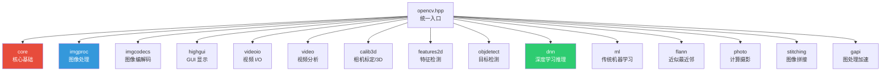
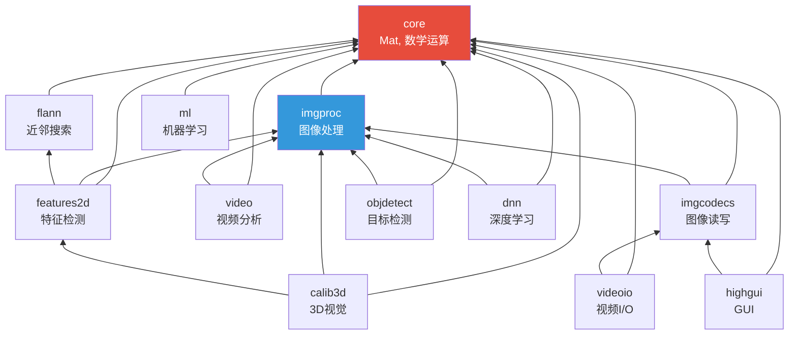
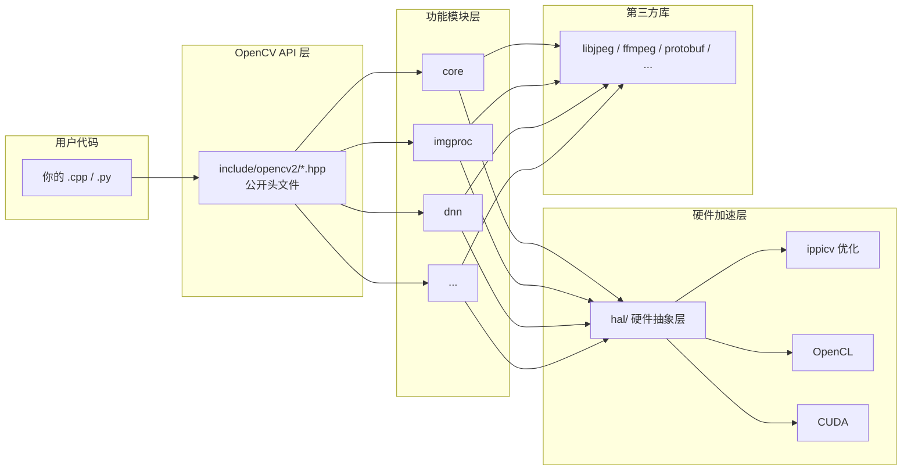

# OpenCV 源码结构详解

基于你本地仓库 `/Users/mac/Documents/GitHub/opencv` 的实际文件结构。

---

## 一、顶层目录总览

```
opencv/
├── CMakeLists.txt      ← 🔧 顶层构建入口（84KB，非常大）
├── 3rdparty/           ← 📦 内置的第三方依赖库
├── apps/               ← 🖥️ 独立的应用程序
├── cmake/              ← 🔧 CMake 构建脚本和工具链
├── data/               ← 📊 测试数据（图像、XML 分类器等）
├── doc/                ← 📖 文档
├── hal/                ← ⚙️ 硬件抽象层（Hardware Abstraction Layer）
├── include/            ← 📋 全局头文件入口
├── modules/            ← ⭐ 核心！所有功能模块
├── platforms/          ← 📱 跨平台支持（Android/iOS/Linux ARM 等）
├── samples/            ← 📝 示例代码
└── build/              ← 🏗️ 编译输出目录（本地生成）
```

---

## 二、`modules/` — 核心模块（最重要的目录）

OpenCV 采用 **模块化架构**，每个功能领域都是一个独立模块：



### 各模块功能说明

| 模块 | 功能 | 典型用途 |
|------|------|---------|
| **core** | 基础数据结构（`Mat`、`Vec`、`Point`）、矩阵运算、内存管理 | 一切的基础，必须有 |
| **imgproc** | 图像处理（滤波、边缘检测、形态学、颜色转换、直方图） | `cvtColor`, `GaussianBlur`, `Canny` |
| **imgcodecs** | 图像文件读写（PNG/JPG/TIFF...） | `imread`, `imwrite` |
| **highgui** | 窗口显示、鼠标/键盘事件、GUI 滑动条 | `imshow`, `waitKey` |
| **videoio** | 视频文件和摄像头的读写 | `VideoCapture`, `VideoWriter` |
| **video** | 运动分析（光流、背景减除、目标跟踪） | `calcOpticalFlowFarneback` |
| **calib3d** | 相机标定、姿态估计、立体视觉、3D 重建 | `calibrateCamera`, `solvePnP` |
| **features2d** | 特征点检测与描述（ORB, SIFT, BRISK） | `ORB::detect`, `BFMatcher` |
| **objdetect** | 目标检测（Haar 级联、HOG、QR 码检测） | `CascadeClassifier` |
| **dnn** | 深度学习推理（加载 ONNX/TF/Caffe 模型） | `dnn::readNetFromONNX` |
| **ml** | 传统机器学习（SVM, KNN, 决策树, 随机森林） | `ml::SVM::create` |
| **flann** | 快速近似最近邻搜索 | 配合 features2d 做特征匹配 |
| **photo** | 计算摄影（去噪、HDR、图像修复） | `fastNlMeansDenoising` |
| **stitching** | 全景图像拼接 | `Stitcher::create` |
| **gapi** | 图处理（Graph API）加速框架 | 异构计算加速 pipeline |
| **java** / **python** / **js** / **objc** | 各语言绑定的生成代码 | 跨语言支持 |

---

## 三、每个模块的内部结构（以 `core` 为例）

**每个模块都遵循统一的目录布局**，这是理解 OpenCV 的关键：

```
modules/core/
├── CMakeLists.txt          ← 该模块的构建定义
├── include/
│   └── opencv2/
│       └── core.hpp        ← 该模块的公开头文件（用户 #include 的）
│       └── core/           ← 更细分的头文件
├── src/                    ← C++ 实现代码（不暴露给用户）
├── test/                   ← 单元测试
├── perf/                   ← 性能基准测试
├── doc/                    ← 模块文档
├── misc/                   ← 杂项（Python 绑定配置等）
└── 3rdparty/               ← 模块级的第三方依赖（如有）
```

> [!IMPORTANT]
> **关键设计原则**：`include/` 下的头文件是**公开 API**，`src/` 下是**私有实现**。用户只需要 `#include <opencv2/core.hpp>` 而不需要关心 `src/` 里的细节。这就是经典的**头文件/实现分离**模式。

---

## 四、`include/opencv2/opencv.hpp` — 统一入口

从 [opencv.hpp](file:///Users/mac/Documents/GitHub/opencv/include/opencv2/opencv.hpp) 可以看到它的设计思路：

```cpp
// Core 永远包含
#include "opencv2/core.hpp"

// 其他模块按条件编译包含
#ifdef HAVE_OPENCV_IMGPROC
#include "opencv2/imgproc.hpp"
#endif
#ifdef HAVE_OPENCV_DNN
#include "opencv2/dnn.hpp"
#endif
// ... 其他模块
```

所以当你写 `#include <opencv2/opencv.hpp>` 时，它会自动引入所有已编译的模块。如果只需要某个功能，可以单独引入：

```cpp
#include <opencv2/core.hpp>      // 只要核心
#include <opencv2/imgproc.hpp>   // 只要图像处理
```

---

## 五、模块依赖关系

模块之间有层次依赖，`core` 是所有模块的基础：



---

## 六、`3rdparty/` — 内置第三方库

OpenCV 自带了大量第三方库以减少外部依赖：

| 库 | 用途 |
|----|------|
| **zlib / zlib-ng** | 数据压缩 |
| **libjpeg / libjpeg-turbo** | JPEG 编解码 |
| **libpng / libspng** | PNG 编解码 |
| **libtiff** | TIFF 编解码 |
| **libwebp** | WebP 编解码 |
| **openexr** | HDR 图像格式 |
| **openjpeg** | JPEG 2000 |
| **protobuf** | Protocol Buffers（DNN 模块使用） |
| **flatbuffers** | 序列化（DNN 模块使用） |
| **ffmpeg** | 视频编解码 |
| **tbb** | Intel 线程并行库 |
| **ippicv** | Intel 性能优化库 |

---

## 七、`samples/` 和 `apps/`

- **`samples/`** — 学习用的示例代码，按语言分类：`cpp/`、`python/`、`java/`、`dnn/` 等
- **`apps/`** — 独立的工具应用：
  - `annotation` — 图像标注工具
  - `createsamples` — 生成训练样本
  - `traincascade` — 训练 Haar 级联分类器
  - `interactive-calibration` — 交互式相机标定
  - `opencv_stitching_tool` — 图像拼接工具

---

## 八、整体架构思维导图



> [!TIP]
> **理解 OpenCV 结构的核心要点**：
> 1. **模块化** — 功能按领域划分为独立模块，各有 `include/` + `src/` + `test/`
> 2. **层次依赖** — `core` 是基础，其他模块在其上构建
> 3. **头文件即 API** — 用户只接触 `include/opencv2/` 下的头文件
> 4. **CMake 驱动** — 整个构建由 CMake 管理，模块可选择性编译
> 5. **多后端加速** — 底层通过 HAL 层支持 CPU/GPU/IPP 等多种硬件
